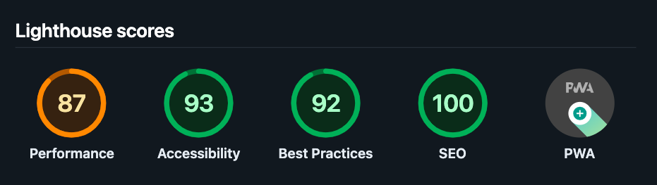

Below is a more polished and cohesive `README.md` that incorporates your existing content, highlights the purpose of the project, and emphasizes mid-senior-level best practices. Feel free to tweak it further based on your specific needs or preferences.

---

# Gatsby Theme UI Template Starter 2025 Project

[](https://app.netlify.com/sites/gatsby-ui-theme/deploys)



## Overview

This project serves as a comprehensive **design system interface** built with **Gatsby**, **Theme UI**, and **MDX**. It is designed to streamline the creation of scalable, modern, and visually appealing web interfaces—particularly useful for mid-senior-level developers seeking insights into best practices and advanced implementation strategies.

By leveraging **Theme UI**’s robust API, we enable customizable and responsive UI components while ensuring seamless integration through Gatsby’s plugin ecosystem. This approach yields:

- **High performance** via Gatsby's optimizations
- **Visual consistency** through modular Theme UI configurations
- **Maintainable architecture** that scales for larger teams and projects

Ultimately, this template provides a foundation for building design systems that are both **efficient** and **stylish**, aligning with current best practices in modern web development.

---

## Features

- **Multi-Mode Color Themes**  
  Supports Light, Dark, Purple, and Forest modes. Toggle between modes through a handy dropdown menu.

- **Theme UI Integration**  
  A modular theme structure with dedicated files for colors, typography, spacing, variants, and more—making future updates and expansions effortless.

- **Syntax Highlighting**  
  Powered by **Theme UI** and **@theme-ui/prism**. Easily customize syntax highlighting or use ready-made presets like Night Owl or Dracula.

- **Component-Driven Architecture**  
  Includes reusable components (e.g., `Layout`, `ColorModeToggle`) to ensure consistency and scalability in your projects.

- **Showcase Page**  
  Demonstrates usage of typography, buttons, forms, tables, and color variants—all defined in the theme.

- **Testing Suite**  
  Integrated with **Jest** and **Testing Library** to safeguard component integrity and functionality.

---

## Folder Structure

Below is a high-level look at the project’s folder organization:

```plaintext
gatsby-theme-ui-template/
├── gatsby-config.js               # Configuration for Gatsby plugins
├── gatsby-node.js                 # Handles dynamic page creation
├── src/
│   ├── pages/                     # Site pages
│   │   ├── index.jsx              # Homepage
│   │   ├── posts.jsx              # Post listing page
│   │   ├── about.jsx              # About page
│   │   ├── showcase.jsx           # Theme showcase page
│   │   ├── 404.js                 # Custom 404 page
│   │   ├── GridVariantsPage.jsx   # Grid layout examples
│   │   ├── TypographyDemoPage.jsx # Typography showcase
│   │   └── posts/                 # MDX blog posts
│   │       ├── my-first-post.mdx
│   │       ├── mdx-with-theme-ui.mdx
│   │       ├── dynamic-heading-components.mdx
│   │       ├── welcome-to-colorful-posts.mdx
│   │       └── enhancing-dynamic-pages-with-seo-metadata-in-gatsby.mdx
│
│   ├── templates/                 # Page templates
│   │   ├── using-dsg.js           # Deferred Static Generation example
│   │   ├── post.jsx               # Single post template
│   │   └── posts-page.jsx         # Post listing template
│
│   ├── components/                # Reusable components
│   │   ├── header.jsx             # Main header component
│   │   ├── ColorModeToggle.jsx    # Theme color mode toggle
│   │   ├── variants.jsx           # Variant examples
│   │   ├── ResponsiveTwoColumnGrid.jsx # Responsive grid layout
│   │   ├── BreakpointShowcase.jsx # Debug breakpoints visually
│   │   ├── seo.jsx                # SEO metadata component
│   │   ├── demos/                 # Demo components
│   │   │   └── demoOne.jsx
│   │   ├── __tests__/             # Jest tests
│   │   │   └── Layout.test.js
│   │   ├── layout/                # Layout components
│   │   │   ├── Layout.jsx
│   │   │   ├── FlexLayout.jsx
│   │   │   └── GlobalStyles.jsx
│   │   ├── util/                  # Utility components
│   │   │   ├── CodeBlock.jsx
│   │   │   ├── Message.jsx
│   │   │   ├── Paragraph.jsx
│   │   │   ├── SectionBlock.jsx
│   │   │   ├── Heading.js
│   │   │   └── Section.jsx
│   │   ├── ui/                    # UI-specific components
│   │   │   ├── Header.jsx
│   │   │   ├── Footer.jsx
│   │   │   ├── Main.jsx
│   │   │   ├── Navigation.jsx
│   │   │   └── hero/
│   │   │       └── InvertedBanner.js
│
│   ├── gatsby-plugin-theme-ui/    # Theme UI configuration
│   │   ├── radii.js               # Border radii
│   │   ├── typography.js          # Typography settings
│   │   ├── colors.js              # Color palette
│   │   ├── space.js               # Spacing scale
│   │   ├── forms.js               # Form styles
│   │   ├── syntax.js              # Syntax highlighting
│   │   ├── styles.js              # Global styles
│   │   ├── messages.js            # Message styles
│   │   ├── text.js                # Text variants
│   │   ├── buttons.js             # Button variants
│   │   ├── variants.js            # Component variants
│   │   └── index.js               # Main theme export
│
│   ├── styles/                    # Global CSS styles
│   │   ├── global.css
│   │   └── utils.css
│
│   ├── images/                    # Image assets
│   │   ├── lighthouse-score.png
│   │   ├── gatsby-icon.png
│   │   └── example.png
│
│   ├── utils/                     # Utility scripts
│   │   └── colorMode.js
│
│   ├── hooks/                     # Custom React hooks
│   │   └── use-site-metadata.jsx
├── ...
```

---

## Getting Started

### Prerequisites

- **[Node.js](https://nodejs.org/)** (>= 14.x)  
- **[Gatsby CLI](https://www.gatsbyjs.com/docs/reference/gatsby-cli/)** (optional)

### Installation

1. **Clone the Repository**  

   ```bash
   git clone https://github.com/your-username/gatsby-theme-ui-starter.git
   cd gatsby-theme-ui-starter
   ```

2. **Install Dependencies**  

   ```bash
   npm install
   ```

3. **Run the Development Server**  

   ```bash
   gatsby develop
   ```

4. **Open the Project**  
   Navigate to **[http://localhost:8000](http://localhost:8000)** to see your site in action.

---

## Modular Theme Structure

Our theme is broken down into independent files, each focusing on a specific aspect:

1. **`colors.js`** – Defines color palettes and modes (Light, Dark, Purple, etc.).  
2. **`typography.js`** – Configures fonts, sizes, weights, line heights.  
3. **`space.js`** – Defines spacing scales for margins and paddings.  
4. **`radii.js`** – Sets border radius styles (e.g., `default`, `circle`).  
5. **`buttons.js`** – Defines button styles and variants (e.g., `primary`, `secondary`).  
6. **`forms.js`** – Styles inputs, selects, and textareas.  
7. **`text.js`** – Text variants for headings and displays.  
8. **`variants.js`** – Generic component variants (e.g., `cards`, `badges`).  
9. **`styles.js`** – Global styles for roots, headings, links, and more.  
10. **`index.js`** – Combines everything into a single exportable theme object.

---

### Adding New Variants

To create a new button variant:

1. Open **`src/gatsby-plugin-theme-ui/buttons.js`**.  
2. Define your variant, for example:

   ```js
   const buttons = {
     primary: { /* ... */ },
     secondary: { /* ... */ },
     tertiary: {
       fontWeight: "medium",
       color: "text",
       bg: "muted",
       "&:hover": {
         bg: "highlight",
       },
     },
   };

   export default buttons;
   ```

3. Use the variant in your JSX:

   ```jsx
   <button sx={{ variant: "buttons.tertiary" }}>
     Tertiary Button
   </button>
   ```

---

## Showcase Page

Explore the **Showcase Page** at **[http://localhost:8000/showcase](http://localhost:8000/showcase)** to view live examples of:

- Typography  
- Buttons  
- Forms  
- Colors  
- Tables  

---

## Testing

This project integrates **Jest** and **Testing Library** to verify the reliability of components. To run tests:

```bash
npm test
```

You can find an example test file in:

```
src/components/__tests__/Layout.test.js
```

---

## Example Usage

Below are a few key files you might customize:

- **`src/pages/posts.jsx`** – Main blog listing page  
- **`src/templates/post.jsx`** – Single post template  
- **`src/posts/mdx-with-theme-ui.mdx`** – Example MDX file demonstrating how to use Theme UI in posts

### Customization

- **`Layout.js`**  
  Wraps all pages with consistent header, footer, and global styling.

- **`ColorModeToggle.js`**  
  A dropdown for switching between Light, Dark, Purple, and Forest modes.

- **Global Styles**  
  Located in `src/styles/global.css`, including resets and custom fonts.

- **Utility Classes**  
  Found in `src/styles/utils.css` for quick margin, padding, and text alignment helpers.

---

## Contributing

1. **Fork** the repository  
2. **Create** a new branch: `git checkout -b feature/new-feature`  
3. **Commit** your changes: `git commit -m 'Add new feature'`  
4. **Push** to the branch: `git push origin feature/new-feature`  
5. **Open** a pull request

---

## License

This project is licensed under the [MIT License](LICENSE).  
**Created by Gilberto Alejandro Haro**

---

## Acknowledgments

- [Gatsby](https://www.gatsbyjs.com/)  
- [Theme UI](https://theme-ui.com/)  
- [Testing Library](https://testing-library.com/)

---

Enjoy building with Gatsby and Theme UI! If you have any questions or feedback, feel free to open an issue or create a pull request. Happy coding!
